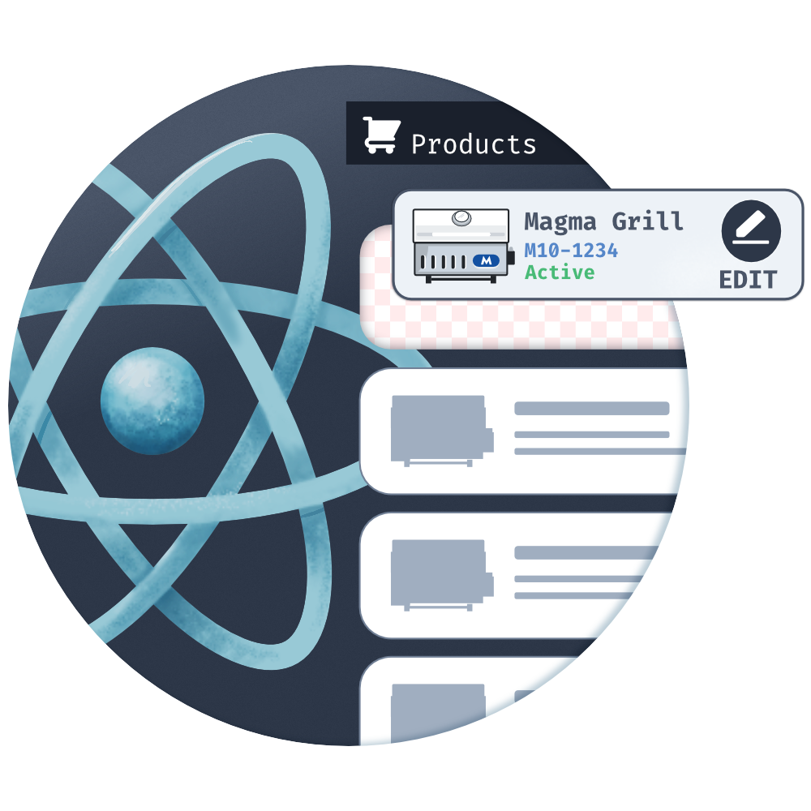
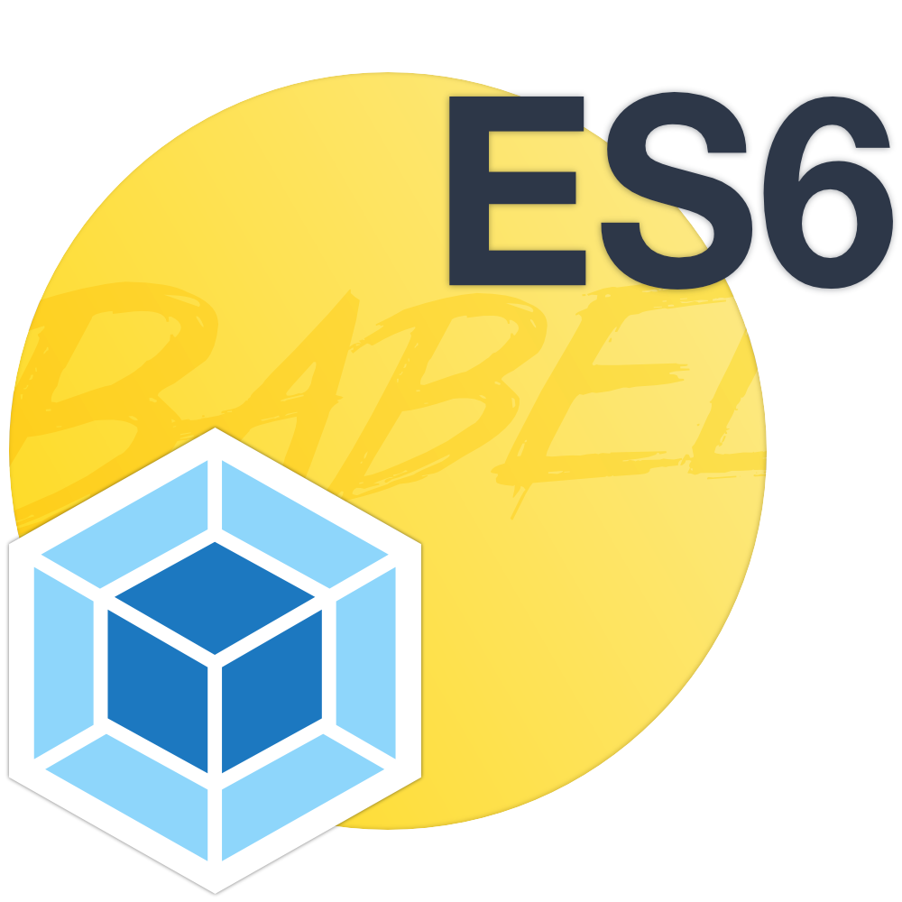
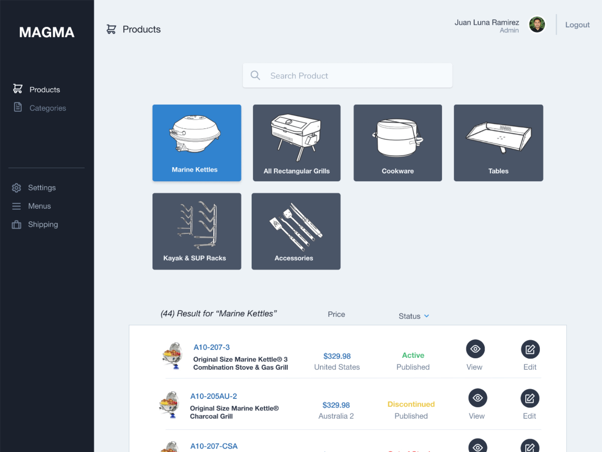
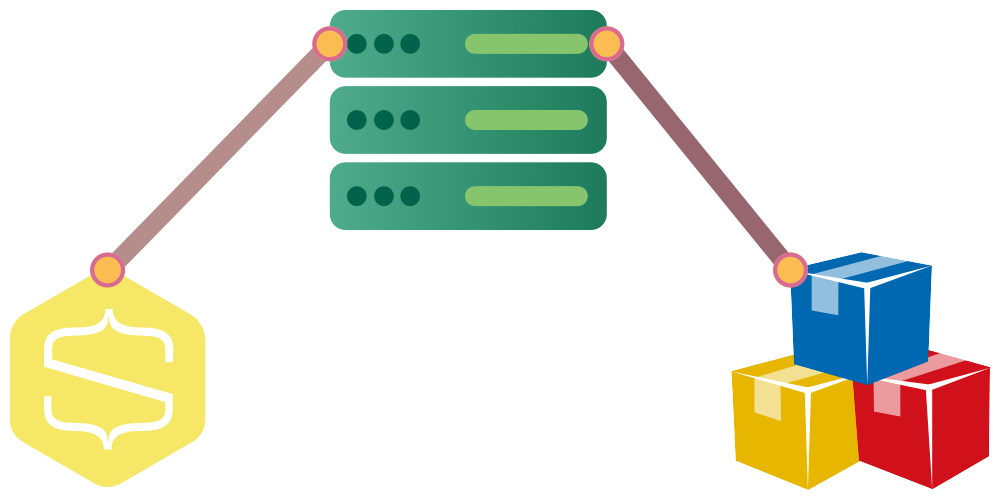
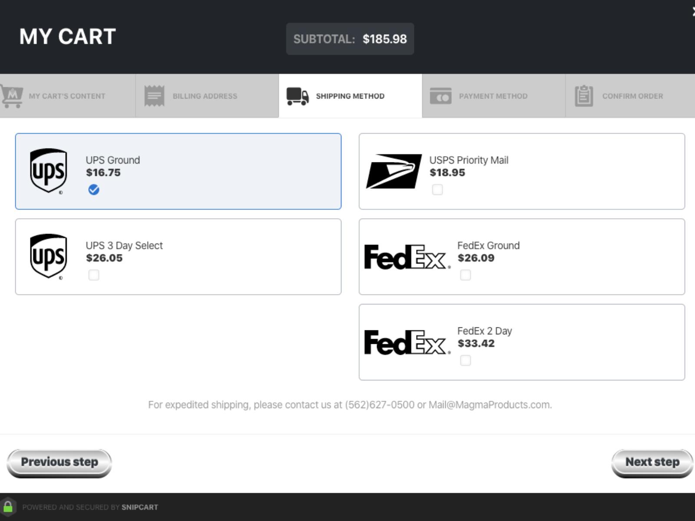

<section id="frontend">

## Frontend

### React

I built a custom React CMS for editing product data. You can find a [simplified demo in my codesandbox](https://codesandbox.io/s/github/lunajuan/cms-react-demo). Some features include:  undo history, rich-text editing with **Draft.js**, form management with **Formik**, validations with **Yup**, and theme switching with **styled-components**.

### SASS
On the public site, I used SASS to construct modular CSS components with the **BEM** methodology and a sprinkle of *atomic* styles.

### JS
Webpack bundles all client-side code from **ES6** to ES5, including polyfills for important features like Promises.

</section>

<section id="backend">

## Backend

### MonogoDB

I deployed over 900 products, each with their own set of images, pdf documents and relations to each other. Some products belonged to a single record, as in the case of variant products, and some belonged to many, as in the case of accessories and replacement parts.

### Express

Routing all browser and API requests

### Pug

Server render public html documents with **pug**

### Deploy
Deployed to a secure Nginx server on **DigitalOcean**

</section>

<section id="third-party">

## Third Party Integrations

  <h3 className="subtitle">APIs, APIs, APIs</h3>

### Snipcart

I create a custom cart flows through their public API. I used their REST API to update Magma Products' internal inventory systems.

### Shipping Rates

Generate custom shipping rate calculations enabled by Snipcart's shipping **Webhook**. Requested data from FedEx (*XML SOAP API*), UPS(*JSON API*), and USPS(*XML API*) to generate custom shipping rate calculations based on the type of products in the cart.

### Shipworks

I built a custom integration between Snipcart and Shipworks to manage the shipment of online orders.

</section>